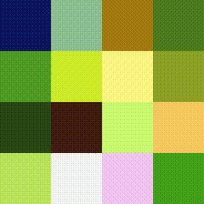
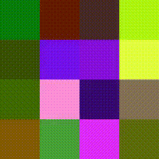

# Algorithmic Playground & Coding Challenges

> I find that I don't understand things unless I try to program them.
>
> &mdash; Donald Knuth

This repository is a curated collection of my programming solutions,
algorithm experiments, and learning notes on my computer science
journey. You'll find both educational implementations and competitive
programming solutions.

**Note**: Code is written for educational purposes, not optimized for
production, and may contain errors.

## Repository Structure

### Codeforces Solutions

`cpp/codeforces` — Solutions from [Codeforces](https://codeforces.com).

### Algorithms & Data Structures

`cpp/warmup` — Educational implementations of core algorithms, data
structures and techniques. Tests for this section were written with
the help of Gemini CLI.

### SICP solutions

`/sicp` — My first experience in programming.


### PipeLLM

`/pipellm` - A simple and lightweight CLI tool for working with the
**Gemini API** using named prompts and shell aliases:

```bash
cat error.txt | grep ERROR | summary | kharms
# → Everything has vanished like smoke, the file exists no more.
```

### Ripples

`/ripples_cli` is a text-based RPG engine powered by Google Gemini. It
generates real-time dialogues and interactions based on a static world
graph and a dynamic event journal.

**Key Mechanics**:

- **World Graph**: Define your world in [DOT](https://graphviz.org/)
  format. Vertices (Nodes) serve as Locations or NPCs.

- **Dynamic Edges**: The LLM generates available player choices in
  real-time, effectively creating new edges in the graph.

- **Living Context**: Key player actions are recorded and serves as
  context for future generations.

### Pet Project (Evolutionary Art)

`pet_project` — An experimental evolutionary algorithm that draws images using pixels, utilizing an ImageNet-trained model as the fitness function. It "evolves" images from random pixels into recognizable shapes.





### Zooreader

`production/docker/zooreader` — A static JavaScript application that allows you to upload and read a PDF file formatted as the Google Chrome "No Internet" dinosaur game, featuring Duke Nukem running through the pages.


### Production Infrastructure

`production/` — A collection of Dockerfiles, Helm charts, and Kubernetes configurations used to manage and deploy my hobby programming infrastructure and personal services.

### AI-Assisted Code

**Note**: Several parts of this repository were generated or assisted by
LLMs. Notably:
- `production/docker/zooreader` was fully generated by an LLM.
- `pet_project` was partially generated by an LLM.
- `cpp/warmup` tests were automatically ported from BATS to GoogleTest.
- Go implementations for **pipellm** and **ripples_cli** were heavily generated based on the project's design specs.

## Purpose

This repository showcases my journey in programming and
algorithms. Feel free to explore the code and use it as a
reference. All constructive feedback is appreciated!

---
