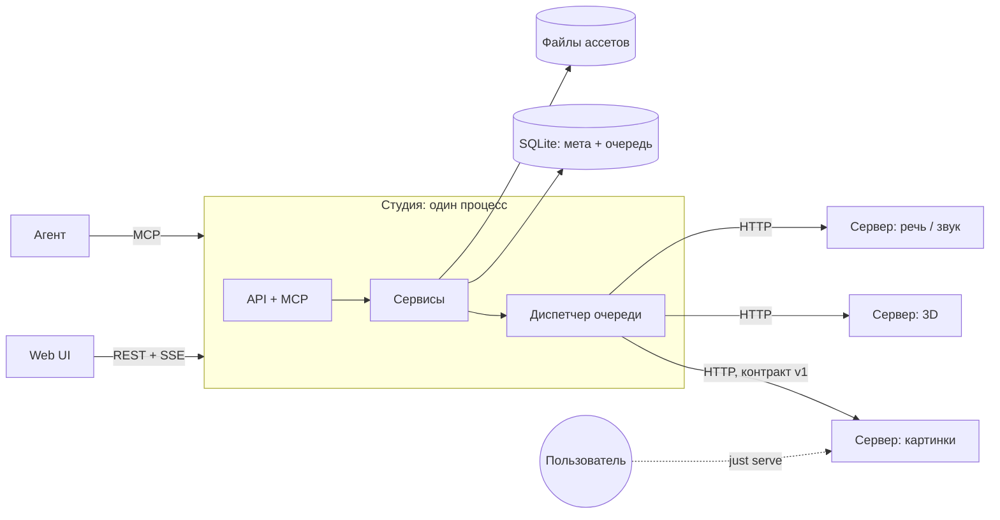
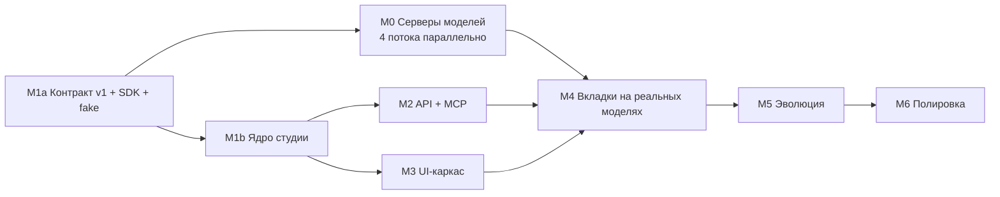

# Студия ассетов — план работ

<!-- markdownlint-disable MD013 -->

Рабочий план на основе концепта из [README.md](README.md). Документ
фиксирует ключевые решения, границы первой версии, майлстоуны с
критериями приёмки и порядок параллельной работы агентов.

## 1. Суть

Локальная студия, в которой человек (через веб-UI) и агент (через
REST/MCP) отправляют задания генеративным моделям — картинки, 3D,
русская речь, звуки — и получают результаты в общую библиотеку ассетов
с историей происхождения.

Модели работают как **самостоятельные локальные серверы**, которые
пользователь запускает вручную. Студия ими не управляет: она знает их
адреса, показывает доступность и отправляет задания. Для X-to-X
модальностей есть **эволюционный режим**: 3 кандидата → выбор →
следующее поколение с мутациями.

## 2. Принятые решения

| Вопрос | Решение |
| --- | --- |
| Назначение | Хобби: студия не публикуется, игры не продаются. Некоммерческие лицензии моделей допустимы. |
| Язык речи | Преимущественно русский. |
| Доступ | Только этот ноутбук: всё слушает `127.0.0.1`, авторизации нет. |
| Существующие скрипты (`games/platformer` — удалён после переноса TripoSR в студию, `local_llm`) | Код не переносим, пишем с нуля под заранее понятные цели. Берём **знания**: TripoSR запускается локально, закреплённые версии torch/CUDA, обход сборки `torchmcubes` через CPU marching cubes, особенности Vulkan и llama.cpp на этой машине. |
| Запуск моделей | Вручную, отдельными серверами. Студия только подключается к ним. |
| Эволюция | В v1 только X-to-X. LLM-мутации промптов возможны позже как отдельная функция. |
| Ресурсы ноутбука | **Не забота студии.** Студия не следит за VRAM, не ограничивает число запущенных серверов и не строит функции вокруг железа. Какие серверы и сколько держать одновременно, решает пользователь. |
| `asset_lab` | Остаётся как есть; в студию не мигрирует. |

## 3. Ограничения окружения

| Ограничение | Следствие |
| --- | --- |
| RTX 3070 Laptop, 8 ГБ VRAM, 30 ГБ RAM | Касается только выбора моделей в M0: сервер модели должен запускаться на этом ноутбуке. На архитектуру и функции студии не влияет. |
| Модели с несовместимыми зависимостями | У каждого сервера модели своё окружение (`uv` + lock-файл). Ядро студии не зависит от torch. |
| Рабочая копия лежит в Dropbox | Веса, база и артефакты — **вне Dropbox** (настраиваемые пути, по умолчанию XDG-каталоги). |
| В песочнице агента GPU может быть скрыт | Студия тестируется с **fake-сервером модели** без GPU; GPU-проверки — отдельная команда. |

## 4. Границы первой версии

**Входит:** text-to-image и image-to-image, image-to-3D, text-to-3D как
цепочка «текст → картинка → 3D», text-to-speech (русский),
text-to-audio (звуковые эффекты и короткая музыка), библиотека ассетов,
очередь, REST + MCP, эволюция для image-to-image (и audio-to-audio, если
модель из M0 это поддерживает).

**Не входит в v1:** запуск и остановка моделей из студии, LLM-вкладка и
LLM-мутации, авторизация, облачные API, дообучение, риггинг и анимация,
видео, нативные text-to-3D модели.

## 5. Архитектура

### 5.1 Компоненты



- **Студия** — один процесс (FastAPI): HTTP API, MCP, раздача UI и
  файлов, а также фоновый **диспетчер**, который берёт задания из
  очереди в SQLite и отправляет их серверам моделей. Отдельный процесс
  Worker не нужен: студия ничего не запускает.
- **Сервер модели** — самостоятельная программа в своём окружении,
  запускается командой `just serve` в своём каталоге. Модель
  загружается при старте. Сервер реализует общий HTTP-контракт (§5.2)
  и сам описывает, что умеет.

Бонус разделения: агент может поставить задание, когда сервер ещё не
запущен. Задание ждёт в очереди в статусе «ожидает модель» и уходит
на сервер, как только тот стал доступен.

### 5.2 Контракт сервера модели (ключевой)

Все серверы моделей реализуют один маленький HTTP-контракт, поэтому новую
модель студия подхватывает без правки своего кода. Эталон —
[ADR-001](docs/adr/0001-model-server-contract.md) и
`model_server_sdk/src/model_server_sdk/contract.py`. Коротко:

- `GET /v1/info` — состояние (`loading | ready | busy | error`), модель и
  список задач. Для каждой задачи указаны: нужен ли промпт, входы по
  ролям, JSON Schema параметров, `max_count` и типы результатов.
- `POST /v1/generate` — синхронная генерация `count` результатов. Файлы
  передаются в base64. Ответ содержит модель, фактические параметры и
  seed каждого результата.
- Единый формат ошибок с флагом `retryable`; параллельный запрос
  получает `409 busy`.

**SDK сервера модели** (`model_server_sdk`) реализует контракт целиком.
Автор сервера пишет только `load()` и `generate(job)` —
см. [model_server_sdk/README.md](model_server_sdk/README.md). Команда
`python -m model_server_sdk.check URL` проверяет любой сервер на
соответствие контракту.

### 5.3 Серверы и разделы

> С M8 (ADR-004) вкладки строятся сами: конфиг перечисляет серверы, а
> разделы — по виду результата (картинки, 3D, звук, текст, видео); модель
> выбирается внутри раздела. Ниже — исходный замысел M1.

Серверы описаны в конфиге студии, а не зашиты в код:

```toml
# ~/.config/assets-studio/studio.toml
[[servers]]
id = "image"
title = "SDXL"
url = "http://127.0.0.1:9101"

[[servers]]
id = "mesh"
url = "http://127.0.0.1:9102"
```

Интерфейс вкладки строится по `tasks` из `/v1/info`. Для каждого типа
задачи в UI есть шаблон: text-to-image, image-to-image, image-to-3d,
text-to-speech, text-to-audio, audio-to-audio. Форма
«Дополнительно» строится по `params_schema`. Чтобы заменить модель,
достаточно остановить один сервер и запустить другой на том же порту;
вкладка сама покажет новую модель и её параметры.

Индикатор в шапке вкладки: серый — сервер недоступен (с подсказкой,
какую команду запустить), жёлтый — загружается или занят, зелёный —
готов, красный — ошибка.

### 5.4 Хранилище и очередь

Эталон — [ADR-002](docs/adr/0002-storage-and-queue.md). Коротко:

- SQLite (WAL, явный SQL, пронумерованные миграции) для метаданных и
  очереди; файлы ассетов — контентно-адресуемые блобы по sha256.
  Каталог данных — вне Dropbox.
- Каждое задание хранит снимок модели и фактические параметры из ответа
  `/v1/generate`: модели меняются вручную, и снимок — единственный способ
  понять, чем сделан результат.
- Очередь: `queued → waiting_model → running → succeeded | failed |
  cancelled`. Одно задание в работе на адрес сервера; задания ждут, пока
  сервер не станет `ready`. На зависимостях между заданиями строится
  text-to-3D (картинка → 3D).
- Упавшее или прерванное задание повторяется как новое задание, а не
  переписывается.

### 5.5 Эволюционный режим (X-to-X)

- **Image-to-image.** Кандидаты поколения — img2img от выбранной
  картинки, каждый с новым seed. «Сила мутации» (слабая / средняя /
  сильная) задаёт `strength`. Промпт пользователь может поправить руками
  перед следующим поколением: это направленная мутация без LLM.
- **Audio-to-audio** — так же, если сервер звука объявил эту задачу
  (Stable Audio Open умеет генерировать от начального аудио; проверяется в M0d).
- Одно поколение = одно задание с `count = 3`: модель вызывается один
  раз на поколение.
- История — дерево: ветвление возможно от любого кандидата любого поколения.
- Для text-to-X без эволюции есть простой режим **«Варианты»**: N
  результатов с разными seed в одном задании.

Эволюция не привязана к конкретной вкладке. Она доступна везде, где
сервер объявил X-to-X задачу.

### 5.6 API и MCP

REST (из OpenAPI генерируются TS-типы для UI):

- `GET /api/servers` — серверы моделей, их живой статус и задачи (ADR-004)
- `POST /api/jobs`, `GET /api/jobs/{id}`, `GET /api/jobs?status=`, `POST /api/jobs/{id}/cancel`, `POST /api/jobs/{id}/retry`
- `GET /api/events` — SSE: статусы заданий и серверов
- `GET /api/assets`, `POST /api/assets` (файл или URL), `GET /api/assets/{id}/file`, `GET /api/assets/{id}/lineage`
- `POST /api/evolutions`, `POST /api/evolutions/{id}/next` (выбор кандидата, сила мутации, правка промпта)

MCP-инструменты повторяют сценарии: `list_servers` (включая, какие
модели сейчас доступны), `generate`, `wait_for_job` (long-poll с
таймаутом), `list_assets`, `get_asset` (включая локальный путь к файлу),
`import_asset`, `start_evolution`, `next_generation`. Запросы
поддерживают `idempotency_key`.

MCP-сервер работает в процессе студии (streamable HTTP), чтобы UI и
агент видели одну и ту же очередь.

### 5.7 Интерфейс

Ориентир — Mixamo. Верхняя панель: вкладки из конфига и
**Библиотека**; у каждой вкладки индикатор доступности; справа в панели
счётчик очереди. Все вкладки устроены одинаково:

- слева узкая колонка: промпт или вход, 2–3 главных параметра,
  свёрнутое «Дополнительно», кнопки «Сгенерировать», «Варианты» и
  «Эволюция» (последняя — только для X-to-X);
- в центре крупное превью: картинка, `model-viewer` для GLB, плеер с
  волной для аудио;
- снизу лента истории вкладки.

Вход для image-to-X: перетаскивание файла, URL или выбор из библиотеки.
Любой результат передаётся в другую вкладку кнопкой («→ 3D»).

Стек: Vite + TypeScript + Preact, без UI-кита. `model-viewer` и
`wavesurfer.js` собираются в бандл, без CDN.

### 5.8 Раскладка кода

```text
assets_studio/
  README.md, PLAN.md, flake.nix, justfile
  docs/adr/                # контракт v1, схема БД, …
  docs/models/             # отчёты M0
  docs/reviews/            # журналы ревью критиком
  studio/                  # Python-пакет студии (без torch)
    domain/                # сущности и правила, без I/O
    storage/               # db.py, migrations/, blobs.py
    dispatch/              # очередь, диспетчер, клиент контракта, опрос /v1/info
    services/              # generation, evolution, library — единая точка для API и MCP
    api/  mcp/
  model_server_sdk/        # общий пакет для серверов моделей
  model_servers/
    fake/                  # детерминированный сервер для тестов, без GPU
    <имя>/                 # pyproject + uv.lock, server.py, justfile (serve, doctor)
  web/
  tests/
```

Правила зависимостей: `domain` ни от чего не зависит; `api` и `mcp`
зависят только от `services`; `studio` и `model_servers` общаются только
по HTTP-контракту (`model_server_sdk` содержит pydantic-модели контракта,
их импортирует и студия). Правила проверяются в CI (import-linter).

Инструменты: Python 3.12+ для студии, `ruff`, `pyright` в strict для
`studio/` и SDK, `pytest`; `tsc`, `eslint` для `web/`. Собственный
`flake.nix` по образцу `local_llm`.

## 6. Майлстоуны



Сначала фиксируется контракт и SDK (M1a). Тогда серверы моделей в M0
сразу пишутся на контракте, а не как одноразовые PoC-скрипты.
Результаты M0 могут изменить контракт: это разрешено до закрытия M4.

### M1a. Контракт v1, SDK, fake-сервер (последовательно, первым)

- ADR-001: контракт сервера модели (§5.2).
- ADR-002: схема БД и очереди (§5.4).
- `model_server_sdk`; `model_servers/fake`: объявляет все типы
  задач, возвращает детерминированные картинки, GLB и WAV, умеет
  имитировать задержку, `busy` и ошибки.

**Приёмка:** контрактные тесты проходят на fake-сервере; ADR прошли ревью критика.

### M0. Серверы моделей (4 параллельных потока)

В каждом потоке агент находит кандидатов на Hugging Face, проверяет
2–3 лучших и оформляет победителя как сервер на SDK. Отчёт
`docs/models/<поток>.md` для каждого кандидата: лицензия, ревизия,
пиковая VRAM (справочно), время загрузки и генерации, 3–5 примеров результата, вывод.

Стартовые кандидаты. Их нужно перепроверить: список составлен по
состоянию знаний на середину 2026 года.

| Поток | Кандидаты | На что смотреть |
| --- | --- | --- |
| M0a text-to-image + image-to-image | FLUX.1-schnell / dev в NF4 или GGUF; SDXL-семейство; SD 3.5 Medium | Влезает ли FLUX в 8 ГБ без мучительного offload; качество img2img — на нём держится эволюция |
| M0b image-to-3D | TripoSR (эталон, заведомо работает); Stable Fast 3D; Hunyuan3D-2mini; TRELLIS | Лицензия Hunyuan3D не действует на территории ЕС — решает пользователь; TRELLIS, вероятно, не влезет в 8 ГБ |
| M0c text-to-speech (русский) | Silero TTS; XTTS-v2 (клонирование голоса); русские дообучения F5-TTS; Fish Speech / OpenAudio; Piper (CPU) | Естественность русской речи, ударения, клонирование по образцу, работа на CPU |
| M0d text-to-audio + audio-to-audio | Stable Audio Open 1.0 / Small; AudioLDM 2; MusicGen | Качество SFX; длительность; есть ли генерация от начального аудио для эволюции |

Состояние на 2026-09-30: M0a — SDXL и FLUX.1-schnell Q8; M0b — TripoSR;
M0c — XTTS-v2; M0d — Stable Audio Open 1.0 (с музыкой до 47 с).
Вкладки названы по моделям.

**Приёмка по потоку:** отчёт; сервер-победитель проходит `just doctor`
(видит устройство, загружает модель) и контрактный smoke-тест на этой
машине.

### M1b. Ядро студии (параллельно с M0)

Хранилище, миграции, блобы, конфиг вкладок, опрос `/v1/info`,
диспетчер (одно задание на вкладку, `waiting_model`, `depends_on`,
идемпотентность, пометка прерванных заданий), сервисы генерации и
библиотеки.

**Приёмка:** интеграционные тесты на fake-сервере: задание ждёт
незапущенный сервер и выполняется после его старта; сервер упал
посреди задания — оно помечено `failed (connection_lost)`, а повтор
создаёт новое задание; `busy` не расходует попытки; цепочка из двух
заданий на разных серверах; идемпотентность; импорт по URL с
ограничением размера и MIME.

### M2. API + MCP (после M1b; параллельно с M3)

REST, SSE, OpenAPI, генерация TS-типов, MCP в процессе студии.

**Приёмка:** e2e-тест: агент через MCP узнаёт доступные вкладки, ставит
задание fake-серверу, дожидается его и получает путь к файлу; тот же
сценарий проходит через REST.

### M3. UI-каркас (после M1b; параллельно с M2, на моках OpenAPI)

Верхняя панель из конфига с индикаторами, шаблоны задач, форма по JSON
Schema, библиотека (фильтры, избранное, lineage), просмотрщики картинок,
GLB и аудио, лента истории, передача результата в другую вкладку.

**Приёмка:** все шаблоны задач работают с fake-сервером; индикатор
переключается при остановке и запуске сервера; ширина 1280 px без
горизонтальной прокрутки; UI-ревью критиком по скриншотам.

### M4. Вкладки на реальных моделях (по модальностям параллельно)

Подключение серверов из M0, конфиг вкладок по умолчанию, доводка
шаблонов под реальные параметры. В 3D-вкладке кнопка «Из текста»
создаёт цепочку text-to-image → image-to-3D.

Перенесено из ревью M3: студия помнит задачи сервера (`last_seen`)
только в памяти; если студию запускают раньше серверов моделей, форму
вкладки нужно сохранять между перезапусками (например, в БД).

**Приёмка:** на реальном GPU каждая вкладка проходит сценарий «запустить
сервер → индикатор зелёный → вход → результат в библиотеке →
скачивание»; результат одной вкладки передаётся в другую; при замене
сервера модели на тот же порт вкладка показывает новую модель без
перезапуска студии.

### M5. Эволюционный режим

Сервис эволюции (§5.5), UI: три карточки кандидатов, выбор, сила
мутации, правка промпта, дерево поколений с ветвлением. MCP:
`start_evolution` и `next_generation`.

**Приёмка:** 5 поколений image-to-image подряд; ветвление от кандидата
старого поколения; время поколения указано в отчёте; audio-to-audio —
если M0d подтвердил поддержку.

### M6. Полировка

Редактирование вкладок в UI (запись в конфиг), подсказка команды
запуска для недоступного сервера, очистка неиспользуемых блобов,
резервная копия БД, одна команда `just studio` для запуска студии.

### M7. Новые модальности (добавлены 2026-09-30)

Запрос пользователя после M0a–M0d. Каждый поток устроен как M0: кандидаты,
отчёт `docs/models/<поток>.md`, сервер-победитель на SDK, проверка
контракта, ревью критиком. Качество важнее скорости.

**Сначала — ADR 0003 «Контракт v1.1»** (обратно совместимое расширение;
сделано 2026-10-01, `docs/adr/0003-contract-text-video.md`):

- задачи `text-to-text`, `image-to-video`, `text-to-3d`;
- канонические форматы `text/plain` (UTF-8) и `video/mp4` (H.264), их
  сигнатуры в SDK и fake-сервере;
- в UI: просмотр текста (с копированием) и видеоплеер; `text-to-text`
  как X-to-X — доступен эволюционному режиму.
- «основные» параметры задачи (например, длительность звука, сила
  изменения) — пометка в схеме параметров; UI показывает их сразу, а не
  в «Дополнительно»;
- импорт звука в библиотеку с перекодированием в WAV (FLAC, OGG, MP3):
  сейчас студия принимает только WAV.

| Поток | Кандидаты | На что смотреть |
| --- | --- | --- |
| M7a text-to-text (LLM) — готово: Gemma 4 12B, Qwen3.8 27B | Qwen3 8B / 14B; Gemma 3 12B; Mistral Small 3.x — GGUF через llama.cpp (часть слоёв на GPU, остальное в RAM) | Качество русского; токены/с при 8 ГБ VRAM + ~18 ГБ RAM; длина контекста; детерминизм при seed |
| M7b image-to-video (от первого кадра) — готово: Wan2.2 TI2V-5B (720p × 5 с ≈ 1 ч) | FramePack (рассчитан на 6 ГБ); Wan 2.2 TI2V-5B; Wan 2.1 I2V-14B в GGUF с group offload (как FLUX); LTX-Video | Качество движения и сохранение первого кадра; длительность и fps; минуты на клип — приемлемо |
| M7c text-to-3D | Цепочка FLUX → TripoSR через `depends_on` (уже есть в ядре); нативные: Hunyuan3D-2 (t2i + форма), TRELLIS text | Нужна ли отдельная модель, или цепочка из двух вкладок даёт лучше; лицензия Hunyuan3D (ЕС) решает пользователь |

M7c начинается с цепочки: она не требует новой модели и сразу проверяет
выбор кандидатов в нативных моделях.

### M8. Предложения пользователя (2026-10-01)

1. **Сделано (ADR-004).** **Удаление ассетов** (кнопка в библиотеке и в истории вкладки):
   ассет пропадает из библиотеки, файл — когда на него больше никто не
   ссылается (задания, родословная). Вместе с «очисткой неиспользуемых
   блобов» из M6.
2. **Сделано (ADR-005).** **Локализация интерфейса (EN, RU)**: строки UI —
   в словарях `web/src/i18n.ts`, переключатель в верхней панели (по
   умолчанию — язык браузера); подписи параметров — английский
   `description` и русский `x-labels` (`ui(ru=...)` в SDK).
3. **Сделано (ADR-004).** **Вкладки по типу задачи, модель — внутри вкладки** («Картинки»:
   SDXL / FLUX, «Текст»: Gemma / Qwen, …). Меняет конфиг вкладок (вкладка
   → список серверов), задания хранят сервер, а не только вкладку
   (миграция БД), «отправить в…» становится проще. Нужен ADR.
4. **Сделано.** **Тёмная тема**: вторая палитра CSS-переменных,
   `prefers-color-scheme` и переключатель «как в системе / светлая /
   тёмная» с запоминанием.
5. **Сделано.** **Картинка в реальном размере**: по щелчку на превью —
   просмотр «Вписать / 100 % / 200 %» на шахматном фоне (видна
   прозрачность); 100 % — пиксель картинки на пиксель экрана.
6. **Zuul CI** — сделано, проверить, когда вернётся кластер. Задание
   `assets-studio-check` (`zuul.d/checks.yaml`,
   `production/playbooks/assets-studio-check.yaml`): `just assets_studio
   check` — студия, SDK, fake-сервер, сборка и линт UI. На билд-ноду
   добавлены только `uv`, `just` и `python311`; без Chrome и `ffmpeg`
   браузерный проход и тесты медиа пропускаются. Серверы моделей (CUDA)
   в CI не проверяются — их `just test` локально. Локально воспроизведено:
   Python 3.14 без скачивания интерпретаторов + 3.11 из nix — всё зелёное.
   Плюс ruff для `assets_studio/` в pre-commit (`pre-submit-check`).

### Отложенный технический долг SDK (решение 2026-10-01)

Вернуться после моделей M7 и основного плана (M4–M6):

- прогресс и отмена посреди генерации (контракт v2): LLM отвечает минутами,
  видео — дольше; сейчас «Отменить» снимает задание только из очереди;
- жизненный цикл сервера в SDK: `close()` при остановке, перевод статуса в
  `error` после загрузки, явная гарантия «модель живёт в одном потоке весь
  срок процесса» (на ней держится PDEATHSIG в сервере LLM);
- конвертация видео при импорте — внутри запроса, до 10 мин без индикации;
- проверка системного `ffmpeg` при запуске студии; правила распознавания
  форматов частично в SDK, частично в студии.

## 7. Процесс работы агентов

- Каждый майлстоун (и каждый поток M0/M4) — отдельная ветка или
  worktree. Агент работает только в своей зоне раскладки (§5.8);
  контракт и схема БД меняются только через ADR.
- **Ревью критиком.** По завершении шага отдельный саб-агент-критик
  получает дифф, критерии приёмки и действующие ADR. Он возвращает
  блокирующие замечания и рекомендации. Цикл «предложение → критика →
  исправление» — **не более 5 итераций**. Если после пятой остались
  блокирующие замечания, решение принимает пользователь. Журнал:
  `docs/reviews/<майлстоун>.md`.
- Критик проверяет: соответствие критериям приёмки, правила
  зависимостей, отсутствие обходных решений (hardcode путей и моделей,
  глушение ошибок, `sleep` вместо синхронизации), тесты на новое
  поведение, актуальность документации.
- GPU-проверки агент выполняет, только если `doctor` видит устройство.
  Иначе он явно пишет в отчёте, что GPU-часть не проверена.

## 8. Риски

| Риск | Мера |
| --- | --- |
| Лучшие модели не запускаются на этом ноутбуке | Квантование, offload, выбор по замерам M0. Это вопрос выбора сервера модели, а не студии |
| Качество русской речи у открытых моделей | Отдельный поток M0c с прослушиванием; допускается несколько серверов речи на выбор |
| Модели меняются вручную, и результаты становится трудно воспроизвести | `model_snapshot` в каждом задании |
| Нет отмены посреди генерации | Осознанное ограничение v1; при необходимости — контракт v2 |
| Гигабайты весов синхронизируются через Dropbox | Данные и кеш по умолчанию вне рабочей копии |
