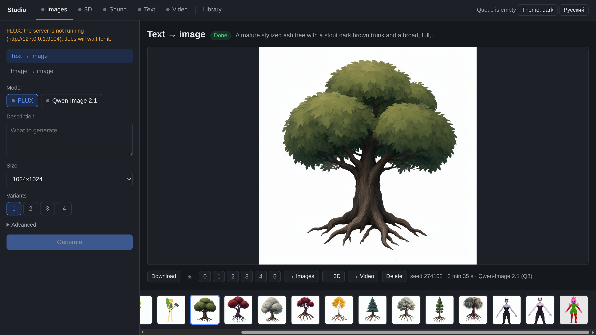
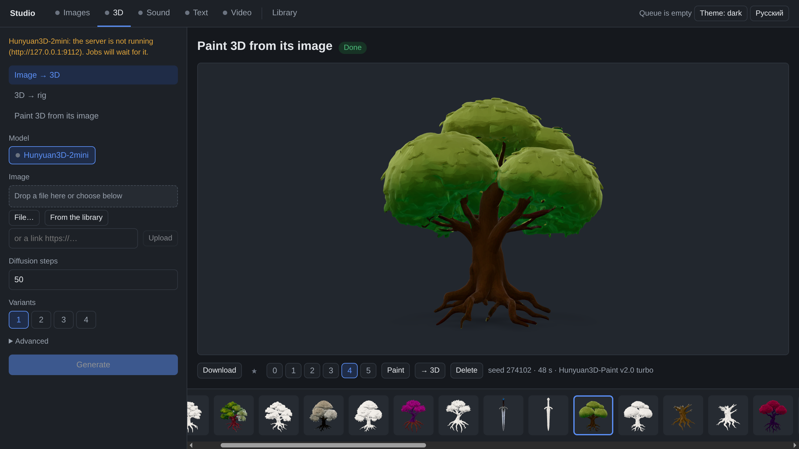
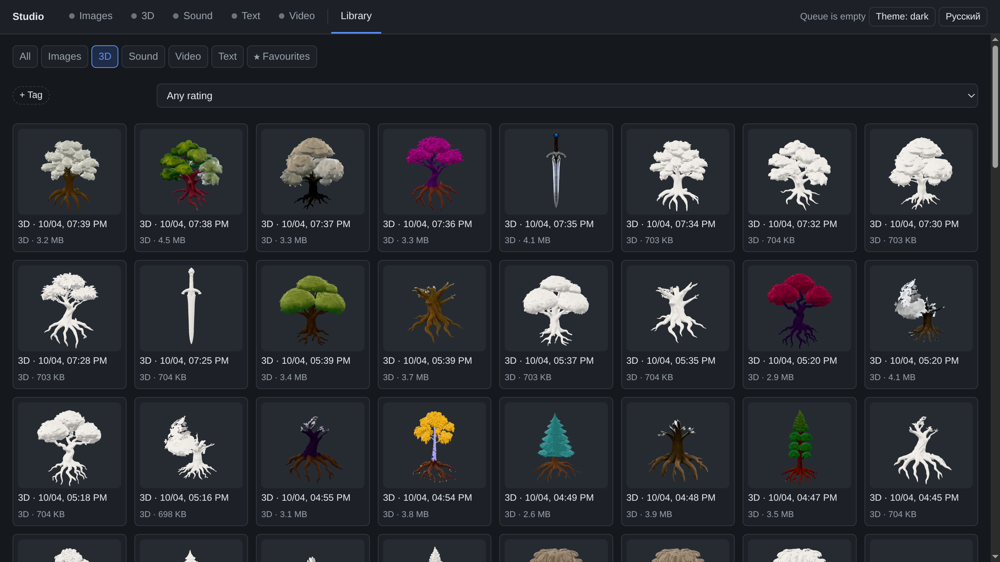
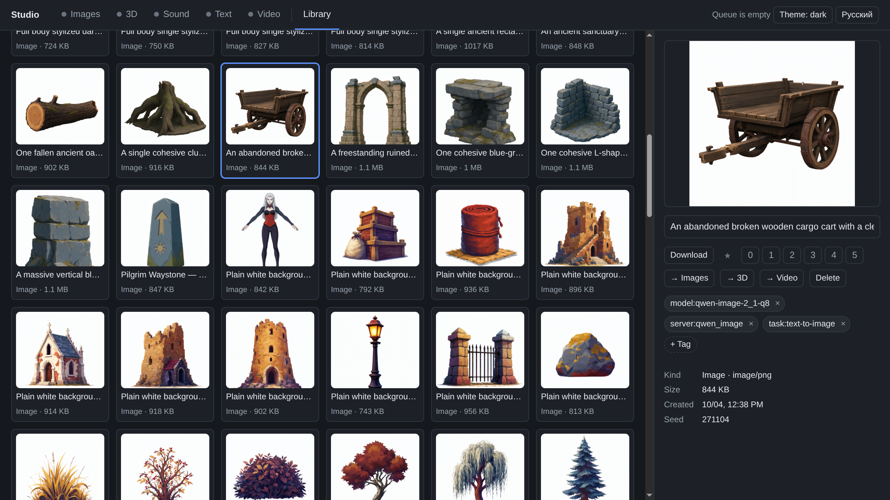
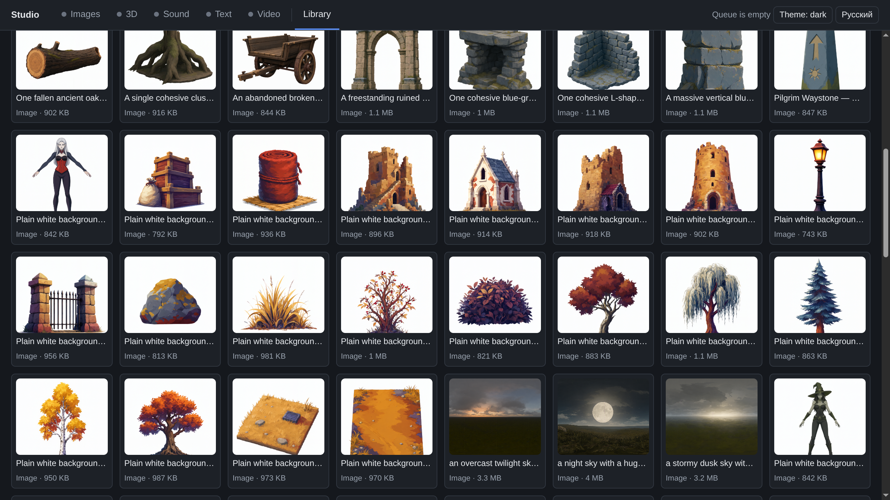
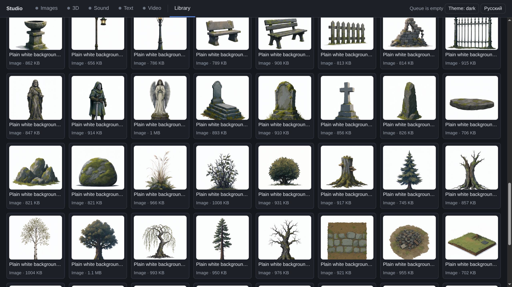

# Asset studio

A local studio for making game assets with generative models: images, 3D
models, speech, sounds and music, text and short videos. People use it
through a web UI, agents through a REST API and MCP.

Each model runs as its own server, started when needed.

<!-- markdownlint-disable MD013 MD033 -->
<p>
  <a href="../static/assets_studio/1-text-to-image.png"></a>
  <a href="../static/assets_studio/2-paint.png"></a>
  <a href="../static/assets_studio/3-library-3d.png"></a>
  <a href="../static/assets_studio/4-asset.png"></a>
  <a href="../static/assets_studio/5-library-concepts.png"></a>
  <a href="../static/assets_studio/6-library-props.png"></a>
</p>
<!-- markdownlint-enable MD013 MD033 -->

## Layout

| Path | What |
| --- | --- |
| `studio/` | The studio: job queue, library (SQLite + files), API, MCP |
| `web/` | The web UI (Preact) |
| `model_server_sdk/` | SDK and contract checker for model servers |
| `model_servers/` | One server per model, each with its own environment |
| `docs/adr/` | Design decisions: the model-server contract, storage, sections |
| `docs/models/` | Why each model was chosen, with measurements |
| `docs/guides/` | How to make game assets: 3D, characters, engine, audio |

## Quick start

```sh
just sync && just web-install && just web-build
mkdir -p ~/.config/assets-studio
cp studio.example.toml ~/.config/assets-studio/studio.toml
just studio                     # http://127.0.0.1:9000
```

Then start the models you need, each in its own terminal:

```sh
cd model_servers
just setup flux                 # once per server: its environment
just flux                       # or: qwen_image, hunyuan3d, xtts,
                                #     stable_audio, gemma, qwen, wan, fake
```

## Models

| Server | Task | Notes |
| --- | --- | --- |
| `flux` | text → image, image → image | FLUX.1-schnell Q8: ~1 min |
| `hunyuan3d` | image → 3D | Hunyuan3D-2mini: shape; + `paint`: [use](docs/guides/3d.md) |
| `hunyuan_paint` | 3D + image → 3D | Hunyuan3D-Paint: paints from the image |
| `mia` | 3D → rig | Make-It-Animatable v2: Mixamo skeleton, skin weights; FBX |
| `xtts` | text → speech | 14 languages, voice cloning |
| `stable_audio` | text → sound, sound → sound | effects and music up to 47 s |
| `gemma`, `qwen` | text → text | Gemma 4 12B, Qwen3.8 27B via llama.cpp |
| `wan` | image → video | Wan2.2 TI2V-5B, 720p × 5 s ≈ 1 hour |

Adding a model means writing a server on `model_server_sdk` and adding it
to the config; the studio needs no changes. Check a server with
`just check-server http://127.0.0.1:<port>`.

## Development

```sh
just check      # lint, types, tests, web UI build and lint (no GPU)
cd model_servers && just test   # each server's own tests (no GPU)
```

Plan and status: [`PLAN.md`](PLAN.md).
