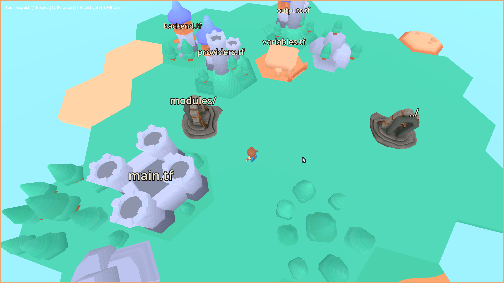
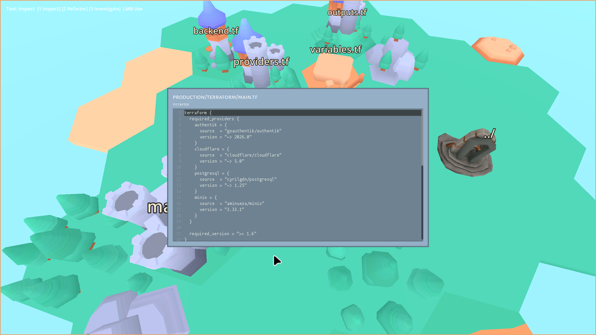
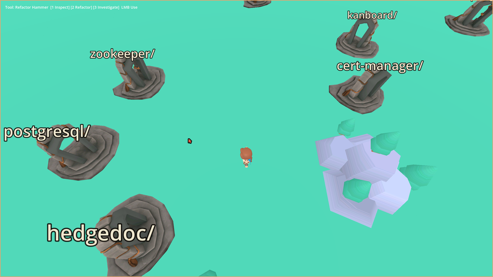
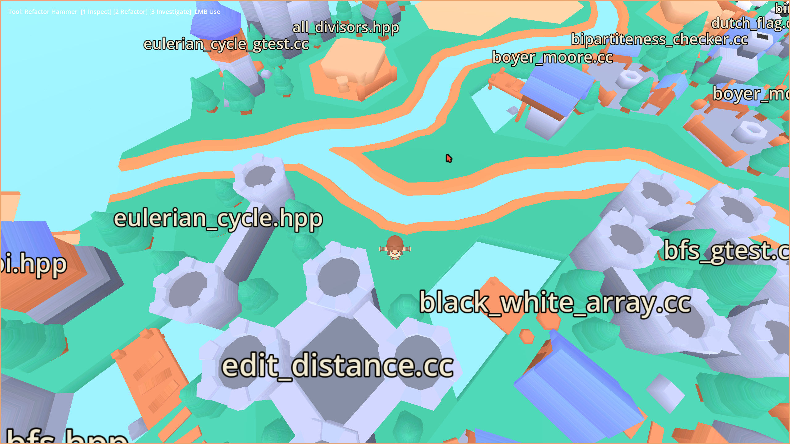
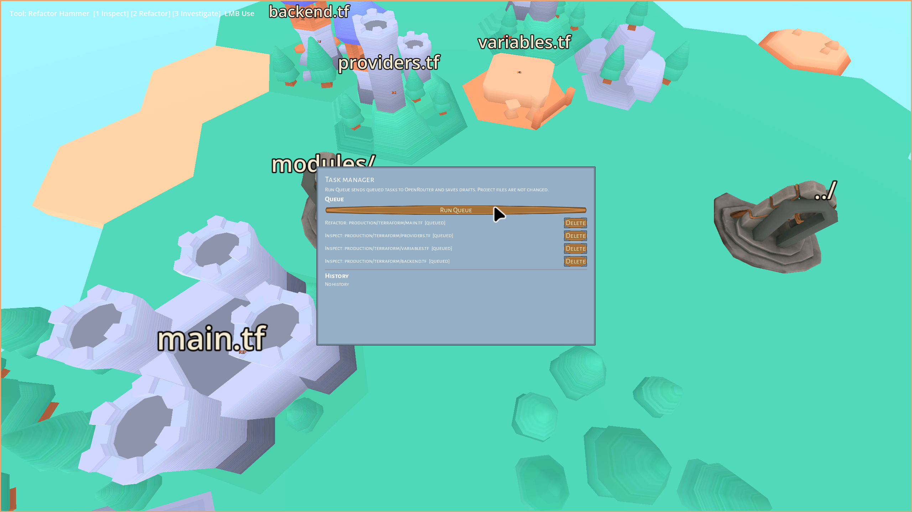

# Cothic

Cothic is a Godot 4.6 prototype for walking through a codebase as an
isometric 3D world.

The player chooses a repository root, explores generated locations for
directories, interacts with files represented as buildings, and uses prompt
tools to inspect, refactor, review, and apply code changes from inside the
game.

## Project Overview

Cothic turns a real repository into a playable isometric map. Each directory is
rendered as a procedurally generated location: connected islands, beaches,
rivers, terrain dressing, file buildings, and directory portals are built from
the structure of the selected codebase.

The goal is to make code navigation spatial and readable without disconnecting
from normal development workflows. Files can be opened inside the game,
directories can be traversed through portals or fast travel, and prompt tools
can queue inspect, refactor, and investigation tasks for later review.











## Current State

Cothic has completed the first functional loop:

- directories generate playable locations;
- files and subdirectories are interactable;
- the player can navigate into child directories and back to parents;
- repository directories are available through an incremental map and fast
  travel panel;
- the last opened repository root is saved for quick reopening;
- text files can be opened in a read-only in-game reader;
- prompt tools can mark files for inspect, refactor, or investigation context;
- queued tasks can be sent to OpenRouter;
- structured JSON drafts are saved under `user://drafts`;
- drafts can be previewed, diffed, rejected, and guardedly applied to disk.

The current work is no longer about proving the core codebase-navigation loop.
The focus is game feel: making generated locations, movement, interface, audio,
and presentation feel like a small readable isometric game.

## World Model

- A repository root is the highest directory the game may access.
- A directory is a generated isometric location.
- A file is a Hexagon Kit building with an interactable area.
- A subdirectory is a portal.
- The parent directory is also represented as a portal when the player is below
  the configured root.
- `Workspace` owns access checks and prevents navigation outside the root.
- `AreaGenerator`, `HexLevelBuilder`, and layer-specific generators turn scanned
  directory entries into the current generated location.

The visual style uses Kenney Hexagon Kit assets from
`assets/models/hexagon-kit`. The current generator creates a connected island
with grass, beaches, sparse terrain variation, water dressing, coast-to-coast
rivers, buildings for files, and portals for directories. Roads are the next
major world-generation layer.

Generated-location order is:

1. island cells;
2. beach cells;
3. river masks and river tiles;
4. buildings and portals;
5. water and terrain dressing.

River generation and calibrated river model masks live in
`scripts/world/river_generator.gd`; those masks should be treated as the source
of truth when adding road/bridge logic.

Generated areas use a random session seed created when the game starts. Within
one run, revisiting the same directory keeps the same island layout; restarting
the game creates a fresh world.

## Important Files

- `project.godot`: Godot project settings and input map.
- `scenes/main.tscn`: main scene, world, player, services, and UI panels.
- `scenes/player.tscn`: player scene.
- `scripts/player_controller.gd`: movement, interaction focus, and modal input
  blocking.
- `scripts/repository/workspace.gd`: root/current path state and access guards.
- `scripts/repository/repository_scanner.gd`: directory scanning.
- `scripts/world/area_generator.gd`: generated-area orchestration.
- `scripts/world/hex_level_builder.gd`: isometric Hexagon Kit level generation.
- `scripts/world/river_generator.gd`: river path generation, calibrated river
  model masks, and rotation matching.
- `scripts/world/world_interactable.gd`: file and directory interactions.
- `scripts/tasks/task_queue.gd`: queued tool actions and task history.
- `scripts/tasks/draft_applier.gd`: guarded replacement writes.
- `scripts/llm/openrouter_adapter.gd`: OpenRouter HTTP adapter.
- `scripts/llm/llm_task_runner.gd`: queued task execution and draft storage.
- `scripts/ui/*`: reader, map, task, draft, diff, prompt, and HUD panels.
- `tools/check-godot.sh`: headless smoke check.

## Controls

- `WASD`: move.
- `Shift`: sprint.
- `E`: interact with the focused file or portal.
- `M`: open the map.
- `T`: open the task queue.
- `1`: select Inspect.
- `2`: select Refactor Hammer.
- `3`: select Investigate.
- Mouse wheel: zoom the isometric camera.
- Left mouse button: use the active tool on the focused file.
- `ui_cancel`: close panels or release mouse capture.

## Model Integration

The OpenRouter path is opt-in through environment variables:

- `OPENROUTER_API_KEY`: enables model requests.
- `OPENROUTER_MODEL`: overrides the default model.
- `COTHIC_DEBUG=1`: saves raw request/response debug JSON under
  `user://debug`.

Model responses must be structured JSON. Markdown draft parsing is intentionally
not supported. Replacement drafts are applied only after `DraftApplier` confirms
that the current file still matches the source text used for generation.

## Tooling

The project lives inside a larger monorepo at `~/src`. Work on Cothic should
stay inside `~/src/cothic` unless explicitly requested otherwise.

The user manages version control manually with Jujutsu between runs. Agents
should not inspect, stage, commit, restore, or otherwise adjust VCS state unless
specifically asked.

Use the monorepo Nix shell for all checks. In Codex sessions, call Nix through
its direct path because `nix` may not be present in the sandbox PATH:

```sh
/nix/var/nix/profiles/default/bin/nix develop -c just cothic-check
```

Individual checks:

```sh
/nix/var/nix/profiles/default/bin/nix develop -c just cothic-fmt
/nix/var/nix/profiles/default/bin/nix develop -c just cothic-lint
/nix/var/nix/profiles/default/bin/nix develop -c just cothic-smoke
```

Launch Godot with an explicit repository root:

```sh
/nix/var/nix/profiles/default/bin/nix develop -c \
  godot --path ~/src/cothic -- --repo-root /path/to/repo
```

Run the main scene briefly in headless mode:

```sh
/nix/var/nix/profiles/default/bin/nix develop -c \
  timeout --preserve-status 5 godot --headless --path ~/src/cothic
```

## Agent Notes

- Read this README and `PLAN.md` before making larger changes.
- Prefer small, playable increments.
- Keep changes scoped to `cothic` unless asked otherwise.
- Use existing Godot scenes and scripts as the source of truth.
- After code or scene changes, run `just cothic-check` through `nix develop`.
- Ask for visual/editor validation when automated smoke checks are not enough.
