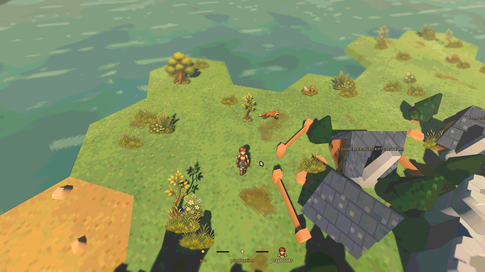
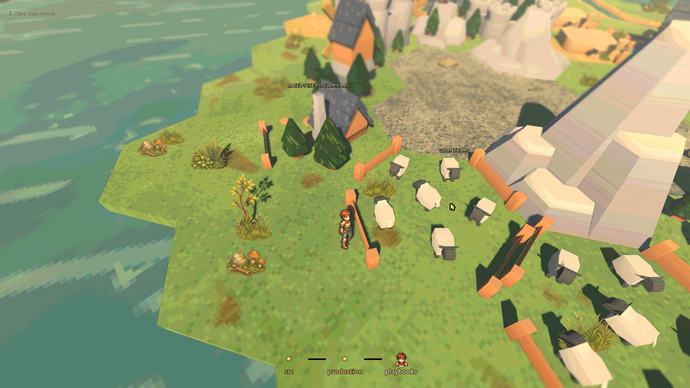
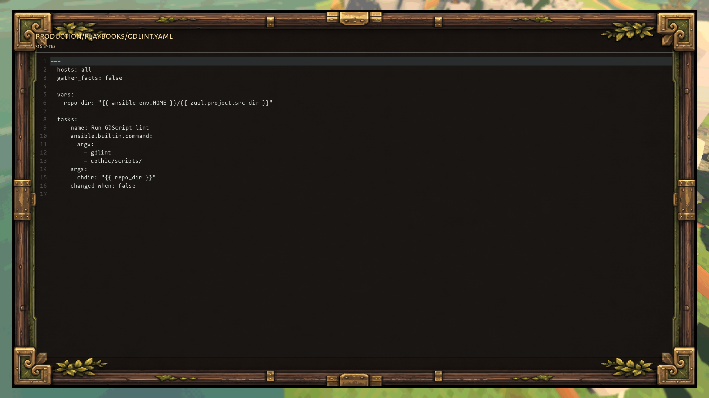
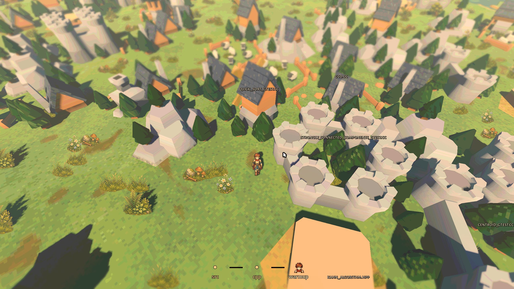
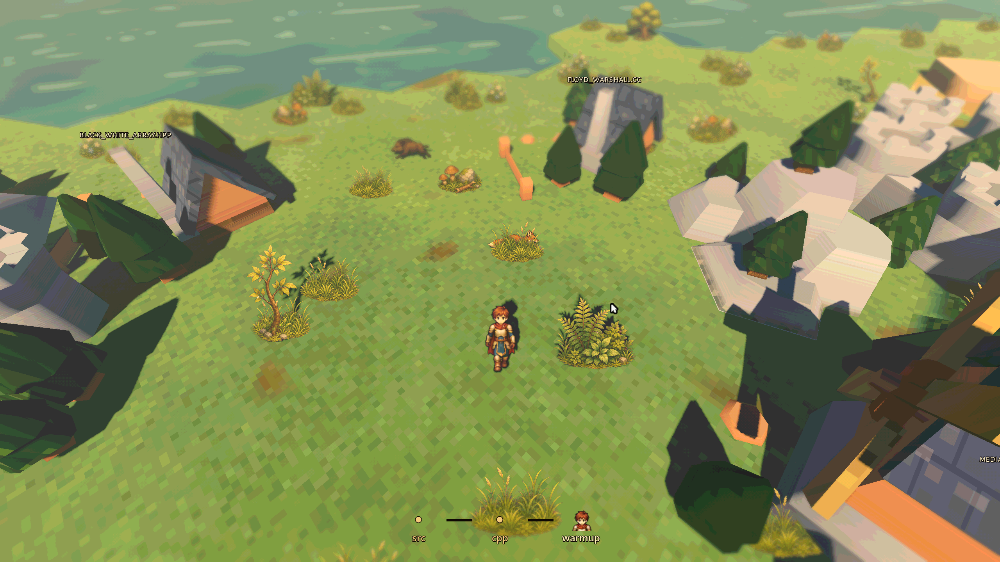
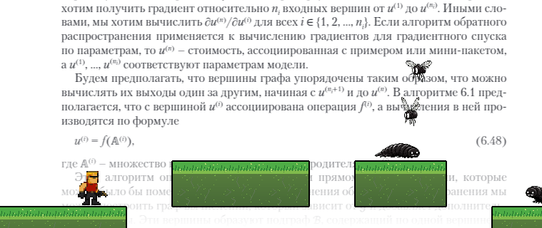

# Games

Small games created with LLM assistance, largely to explore and test models.
Run the commands below from the repository root.

## Vibe Jakubovich

[`vibe_jakubovich_mvp`](vibe_jakubovich_mvp) — An offline Godot remake of
the DOS game «Поле чудес», with a 3D wheel and a dancing host.

![Vibe Jakubovich: spinning wheel and dancing host][jakubovich-preview]

[jakubovich-preview]: ../static/vibe_jakubovich.gif

```sh
nix develop -c just vibe_jakubovich_mvp run
```

## Cothic

[`cothic`](cothic) is a Godot 4.6 prototype that turns a real codebase
into a cozy, explorable isometric world.

Each repository directory becomes a procedurally generated location:
connected islands, beaches, rivers, terrain dressing, file buildings,
and directory portals are built from the structure of the selected
project. Files can be opened in-game, directories can be traversed
through portals or fast travel, and text files can be read in a
read-only in-game viewer.

The world combines stylized 3D terrain with detailed 2D sprites, an
eight-direction animated hero, roaming wildlife, animated water, and
procedural vegetation. A fantasy-inspired reader, map, and path navigation.

<!-- markdownlint-disable MD013 MD033 -->
<p>
  <a href="../static/cothic/img1.png"></a>
  <a href="../static/cothic/img2.png"></a>
  <a href="../static/cothic/img3.png"></a>
  <a href="../static/cothic/img4.png"></a>
  <a href="../static/cothic/img5.png"></a>
</p>
<!-- markdownlint-enable MD013 MD033 -->

## Zooreader

[`zooreader`](zooreader) — A
zero-player platform game layered over PDF reading. The protagonist
independently traverses platforms and fights enemies as the reader
progresses through the page. With an LLM, it can also make brief
comments about the page content.



## Ripples

[`ripples_cli`](ripples_cli) is a text-based RPG engine powered by
Google Gemini. It generates real-time dialogues and interactions based
on a static world graph and a dynamic event journal.

**Key Mechanics**:

- **World Graph**: Define your world in [DOT](https://graphviz.org/)
  format. Vertices (Nodes) serve as Locations or NPCs.

- **Dynamic Edges**: The LLM generates available player choices in
  real-time, effectively creating new edges in the graph.

- **Living Context**: Key player actions are recorded and serves as
  context for future generations.
