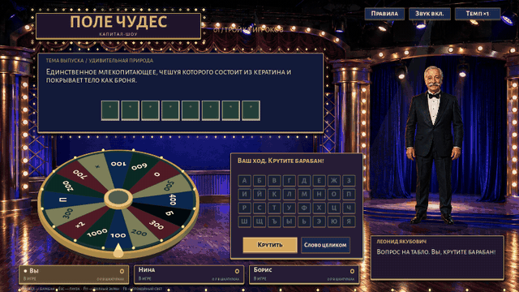

# Поле чудес — вечер в студии

Небольшая офлайн-игра на Godot 4.6: нарисованная OpenAI студия
90-х с анимированным ведущим, объёмный барабан, тройка игроков, финал и суперигра.
Игра использует собственную интерпретацию классического телешоу.



## Запуск

Из корня монорепозитория:

```sh
nix develop -c just vibe_jakubovich_mvp run
nix develop -c just vibe_jakubovich_mvp check
nix develop -c just vibe_jakubovich_mvp build
```

Без Nix достаточно Godot 4.6+: открыть `project.godot` и нажать F5,
либо `godot --path games/vibe_jakubovich_mvp --fullscreen`.
Для `just check` нужны также `gdtoolkit`, Bash и ripgrep.

Для графического запуска `just` предпочитает Godot из `~/.nix-profile/bin`,
если он установлен. На текущем Gentoo это версия с обёрткой nixGL.
Проверки и экспорт используют закреплённый Godot из Nix shell.
Можно явно выбрать другой графический исполняемый файл:

```sh
GODOT=/home/myuser/.nix-profile/bin/godot \
  nix develop -c just vibe_jakubovich_mvp run
```

`build` создаёт `build/pole-chudes.x86_64` и `build/pole-chudes.pck`.
Оба файла нужно держать рядом. Это локальная Nix-сборка: исполняемый файл
зависит от библиотек в `/nix/store` и не является переносимым дистрибутивом.
На текущей машине удобно запускать пакет с графической обёрткой:
`nix develop -c just vibe_jakubovich_mvp play-build`.
Для распространения на обычном Linux понадобится отдельный экспорт
официальным шаблоном Godot; такой дистрибутив пока не проверялся.

## Как играть

Начать игру → вращать барабан → выбрать букву или назвать слово целиком.
При правильной букве ход сохраняется; при неверной переходит сопернику.
«Плюс» позволяет нажать на закрытую клетку табло.
За три самостоятельно угаданные буквы подряд можно выбрать шкатулку.
Правила и пауза доступны кнопкой вверху или Esc.

- Мышь: все действия, экранная русская клавиатура, выбор клетки.
- Пробел: вращение барабана в свой ход.
- F11: переключение полноэкранного режима.
- F8: спокойный режим — без танца, движущегося света и искр; выбор сохраняется.
- Русская клавиатура: ввод буквы; слово вводится в отдельном окне.
- «Темп ×3»: ускоряет решения и вращения соперников.
- «Звук»: отключает и музыку, и звуковые эффекты.

Две другие отборочные тройки разыгрываются автоматически теми же правилами.
Их победители выходят с вами в финал. После победы можно выбрать призы
за очки, закончить выпуск или рискнуть в суперигре.
Рекорд и настройка звука сохраняются в `user://settings.cfg`.
Текущий незавершённый выпуск не сохраняется.

## Что входит в MVP

- Настоящий 3D-барабан в `SubViewport` с указателем и 16 секторами.
- Совпадение результата вращения и сектора под указателем.
- Локальная логика правил, два компьютерных соперника и турнир из 9 игроков.
- Банк из 32 авторских вопросов; пять разных вопросов одной темы за выпуск.
- Классическая суперигра с одним словом, тремя буквами и минутой на ответ.
- Авторская иллюстрация OpenAI, шрифты из Cothic, собственные звуковые сигналы.
- Бархатные кулисы, ламповая вывеска, зелёное механическое табло и пульт-клавиши.
- Четыре рисованные позы ведущего: танец при вращении и праздновании удачной буквы.
- Раскрытие букв, золотые искры, перелистывание счёта, плавный сценический свет.
- Две оригинальные музыкальные петли: фон студии и музыка вращения барабана.
- Подгонка текста под границы табло, реплик и диалогов, без наложения на кнопки.
- Headless-проверки правил, поведения соперников и переходов интерфейса.

Танец — циклическая 2D-спрайтовая анимация, не видео и не motion capture.
Музыка — собственная инструментальная стилизация, не фонограмма телешоу.
Реплики ведущего текстовые. Озвучка, анимация его лица, дополнительные
портреты соперников и сохранение выпуска — возможные следующие улучшения.
Во время игры нет запросов к OpenAI, платных API или внешним сервисам.

## Устройство

- `scripts/round_rules.gd` — правила раунда без графики.
- `scripts/opponent.gd` — выбор по частотности букв и открытому табло.
- `scripts/wheel.gd` — процедурная 3D-геометрия, свет, вращение.
- `scripts/main.gd` — студия, ввод, турнир, призы и суперигра.
- `scripts/sound.gd` — генерация коротких звуков без внешних записей.
- `scripts/host.gd` — позы, дыхание, танцевальные движения ведущего.
- `scripts/stage_effects.gd` — лампы, прожекторы и ограниченный пул искр.
- `scripts/fitted_label.gd` — измерение и подгонка полного текста в отведённую область.
- `tools/compose_music.gd` — исходная партитура и синтезатор музыкальных петель.
- `data/questions.json` — вопросы, независимые от кода интерфейса.
- `tools/test.gd` — проверки правил, 100 партий ботов и UI-переходов.

Пересоздать WAV из исходной партитуры:
`nix develop -c just vibe_jakubovich_mvp music`.
Обычный запуск использует готовые WAV, ничего не синтезирует через API.
`just vibe_jakubovich_mvp capture` снимает студию, две танцевальные позы,
искры и диалоговые окна в `tmp/` (нужен графический сеанс).
`nix develop -c just vibe_jakubovich_mvp gif` записывает небольшую GIF-анимацию
в `assets/previews/wheel.gif` (нужны графический сеанс и FFmpeg).

Из Cothic переиспользованы Compatibility renderer, Nix/just-подход,
идея headless-проверок, экспортный шаблон и Alegreya Sans SC.
Игровая логика и сцены независимы; Cothic не изменён.

Подробности выбранного исторического варианта правил:
[docs/RULES.md](docs/RULES.md).
Источник графики и исходный промпт:
[assets/PROVENANCE.md](assets/PROVENANCE.md).
